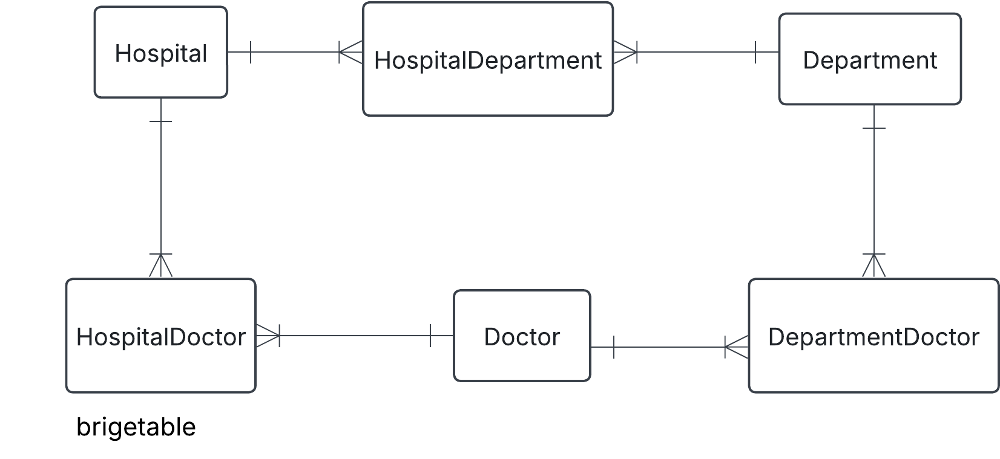

# Exercise 0

## 1. Hospital task

You have this json data, convert it into three tables: Hospital, Department and Doctor. Fill these tables with data. Do this manually and not programmatically.

```json
{
  "hospital": "Sjukhusstock",
  "address": "Drottninggatan 3, Stockholm",
  "departments": [
    {
      "name": "Kardiologi",
      "doctors": [
        { "id": 1, "name": "Dr. Abra Abrahamson" },
        { "id": 2, "name": "Dr. Erika Eriksson" }
      ]
    },
    {
      "name": "Neurologi",
      "doctors": [{ "id": 3, "name": "Dr. Sven Svensson" }]
    }
  ]
}
```

### Solution

- identify entities   识别实体
- identify relationships and cardinalities 识别关系和基数
- create conceptual ERD  创建概念性 ERD
- create tables


**Initial naive conceptual**


**Initial tables**

Hospital

|hospital_id |name   |address|
|---|---|---|
|1   |||

Department


Doctor





HospitalDepartment

HospitalDoctor

TODO: left for the reader

DepartmentDoctor

TODO: left for the reader

Test a join

Want information on Sjukhusstock and its department

- hospital_department can join with department_id on department table and hospital_id on hospital_table
- query name from hospital table and name from department table'

TODO: left for readerL create this SQL query


