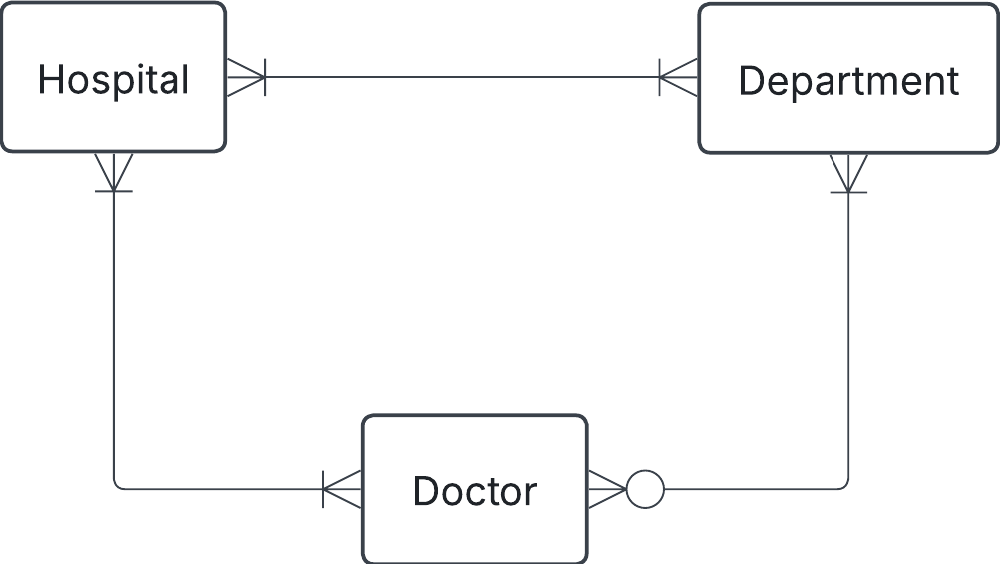

# Exercise 0

## 1. Hospital task

You have this json data, convert it into three tables: Hospital, Department and Doctor. Fill these tables with data. Do this manually and not programmatically.

```json
{
  "hospital": "Sjukhusstock",
  "address": "Drottninggatan 3, Stockholm",
  "departments": [
    {
      "name": "Kardiologi",
      "doctors": [
        { "id": 1, "name": "Dr. Abra Abrahamson" },
        { "id": 2, "name": "Dr. Erika Eriksson" }
      ]
    },
    {
      "name": "Neurologi",
      "doctors": [{ "id": 3, "name": "Dr. Sven Svensson" }]
    }
  ]
}
```

### Solution


Approach
- identify entities   识别实体
- identify relationships and cardinalities 
- 识别关系和基数
- create conceptual ERD  创建概念性 ERD
- create tables


**Initial naive conceptual**




**Initial tables**

Hospital

| hospital_id | name         | address          |
| ----------- | ------------ | ---------------- |
| 1           | Sjukhusstock | Drottninggatan 3 |

Department

| department_id | name       |
| ------------- | ---------- |
| 1             | Kardiologi |
| 2             | Neurologi  |

Doctor

| doctor_id | name                |
| --------- | ------------------- |
| 1         | Dr. Abra Abrahamson |
| 2         | Dr. Erika Eriksson  |
| 3         | Dr. Sven Svensson   |

**Bridge tables**

Refined with bridge tables to reflect many-to-many relationships


HospitalDepartment

| hospital_department_id | hospital_id | department_id |
| ---------------------- | ----------- | ------------- |
| 1                      | 1           | 1             |
| 2                      | 1           | 2             |

HospitalDoctor

| hospital_doctor_id | hospital_id | doctor_id |
| ------------------ | ----------- | --------- |
| 1                  | 1           | 1         |
| 2                  | 1           | 2         |
| 2                  | 1           | 3         |

DepartmentDoctor

| department_doctor_id | department_id | doctor_id |
| -------------------- | ------------- | --------- |
| 1                    | 1             | 1         |
| 1                    | 1             | 2         |
| 2                    | 2             | 3         |


*DepartmentDoctor 里面存的是医生和科室的对应关系*


**Test a join**

Want information on Sjukhusstock and its department

- hospital_department can join with department_id on department table and hospital_id on hospital_table
- query name from hospital table and name from department table

```sql
select * from hospital_department hd
join department d 
on hd.department_id = d.department_id
join hospital h
on hd.hospital_id = h.hospital_id;

```

```sql
select 
    h.name as hospital_name,
    d.name as department_name
from
    hospital_department hd 
join
    hospital h
    on hd.hospital_id = h.hospital_id;
join 
    department d 
    on hd.department_id = d.department_id
where h.name = "Sjukhusstock";

```


