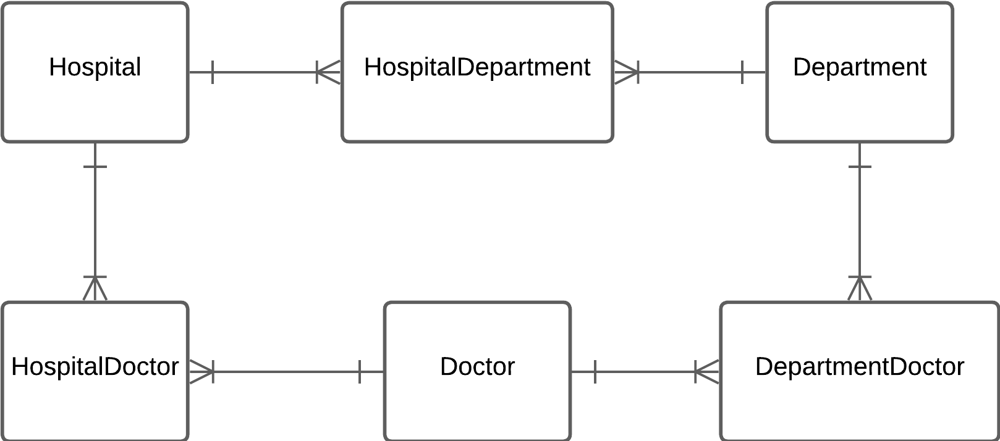
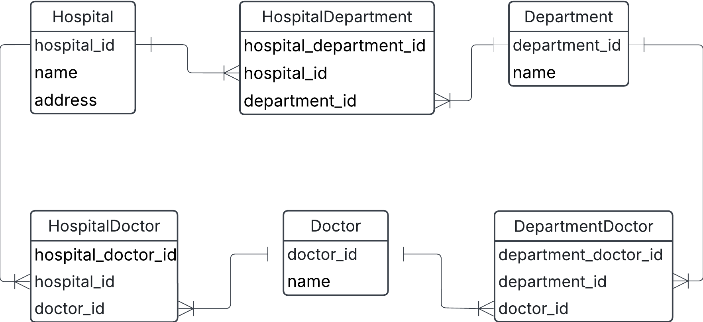

# Exercise 1

## 0. Hospital example

Going back to the hospital exercise from exercise0, task 1, we will build logical and physical data models. This is the conceptual data model after we've added the composite entities to take care of many-to-many relationships.



a) Create a logical data model using lucidcharts

b) Identify different keys on the various entities

c) Identify child entities and parent entities. What makes them into parent/child relationships?

d) Create a physical data model using dbdiagram

e) Create a few tables manually, insert given data plus some more, and try to manually link foreign keys to primary keys. Can you satisfy that a doctor can work at several departments and several hospitals?

### Solution

a) logical data model


                 
b) Identify different keys on the various entities

| Key Type         | Description                                                 |
| ---------------- | ----------------------------------------------------------- |
| Primary Key (PK) | 唯一标识每个实体的属性。例如 doctor_id 是 Doctor 表的主键。 |
| Foreign Key (FK) | 连接不同表的外键。例如 department_id 在 Doctor_Department 里是外键，指向 Department 表。|
| Composite Key | 由多个属性组合形成唯一性。例如 Doctor_Department 的 (doctor_id, department_id) 共同组成主键。|

c) 
1. Parent table (parent entity):
Hospital, Department, Doctor are all primary entities.

2. Child table (child entity):
HospitalDepartment, HospitalDoctor, DepartmentDoctor are association（bridge） tables used to resolve many-to-many relationships.

3. Why are they parent/child tables?
Child tables contain foreign keys to reference the primary key of the parent table to ensure data integrity.    
When deleting records from the parent table, the child table may be affected (such as foreign key constraints that prevent deletion).

d)     
physical data model using dbdiagram


e) 
```sql
CREATE TABLE hospital (
    hospital_id SERIAL PRIMARY KEY,
    name VARCHAR(255) NOT NULL,
    address TEXT
);

CREATE TABLE doctor (
    doctor_id SERIAL PRIMARY KEY,
    name VARCHAR(255) NOT NULL
);

ALTER TABLE doctor
ADD CONSTRAINT fk_hospital FOREIGN KEY (hospital_id) REFERENCES hospital(hospital_id);
```

---------------------

## 2. Identify keys
a)
Possible candidate keys:
- EmployeeID – Each employee has a unique ID.
- E-post (Email) – Emails are usually unique for each employee.
- Telefon (Phone Number) – If phone numbers are unique per employee, this could also be a candidate key.

b)
- Primary Key: EmployeeID (It’s a simple and numeric identifier, making it efficient for indexing and foreign key references.)
- Alternate Keys: E-post (Email), Telefon (Phone Number) (since they are unique but not the best choice for a primary key due to potential changes over time.)

c)
- EmployeeID is a surrogate key, as it is an artificial unique identifier assigned to each employee instead of using a real-world attribute like email or phone number.

d)
- Here’s a Department table where AvdelningID (Department ID) is a primary key, and it connects to the Employee table as a foreign key.

```sql
CREATE TABLE Department (
    DepartmentID INT PRIMARY KEY,
    Name VARCHAR(100) NOT NULL
);

CREATE TABLE Employee (
    EmployeeID INT PRIMARY KEY,
    FirstName VARCHAR(50) NOT NULL,
    LastName VARCHAR(50) NOT NULL,
    AvdelningID INT,  -- Foreign Key
    Email VARCHAR(255) UNIQUE NOT NULL,
    Phone VARCHAR(20) UNIQUE NOT NULL,
    FOREIGN KEY (AvdelningID) REFERENCES Department(DepartmentID)
);
```

----------------------------

## 3. Sakila exercise

In SQL course we have queried the sakila database a lot to learn various concepts such as joining, union, filtering. Now lets download it from kaggle and try to understand its data model.

Study the ERD and try to answer the following questions

a) Is this a conceptual, logical or physical ERD, motivate?

b) How many entities are in the database?

c) Which are the composite entities?

d) Try to find suitable relationship labels between entities

e) Try to write out some possible relationship statements between the entities.

f) Can you find if there is any errors/mistakes in this ERD?


