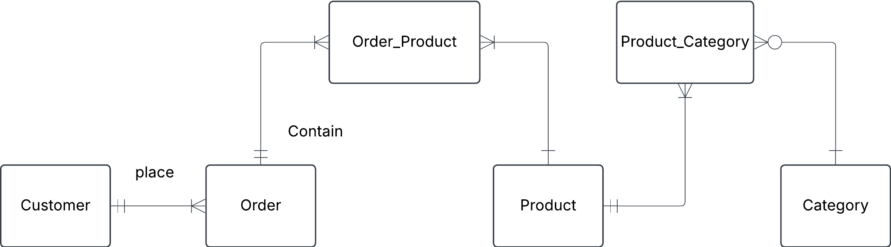

# Exercise 0

## 6. Onshop

An e-commerce platform Onshop manages customers, orders, and products.

- a customer can place multiple orders.
- each order contains multiple products.
- a product can belong to multiple categories.

a) Identify key entities and their attributes (e.g., customer_name, order_date)

b) Sketch the conceptual ERD.

c) Define business rules

### Solution

a)
- Customer（客户） - 代表购买商品的用户
customer_id (主键，PK)
customer_name
email
phone_number
address

- Order（订单） - 代表客户的购买订单
order_id (PK)
customer_id (外键，FK，关联 Customer)
order_date
total_price
status (如 "Pending", "Shipped", "Delivered")

- Product（产品） - 平台上出售的商品
product_id (PK)
product_name
price
stock_quantity

- Category（类别） - 产品分类，如"电子产品"、"服装"
category_id (PK)
category_name

- Order_Product（订单-产品 关系表） - 订单和产品是多对多关系，因此需要一个桥接表（Bridge Table）
order_product_id (PK)
order_id (FK, 关联 Order)
product_id (FK, 关联 Product)
quantity
subtotal_price (单个商品的总价 = price * quantity)

- Product_Category（产品-类别 关系表） - 一个产品可以属于多个类别，因此也需要一个桥接表
product_category_id (PK)
product_id (FK, 关联 Product)
category_id (FK, 关联 Category)

b)

c) Business Rules

1. A customer can create many orders, but a order can only belongs to one customer.
2. A order can contain many products, a product can also in many orders.
3. A product can belong to many categories, a category can also contain many products.
4. Each Order_Product records a specific product in an order and stores quantity and subtotal_price information.
5. Each Product_Category records the relationship between a product and the category it belongs to.

